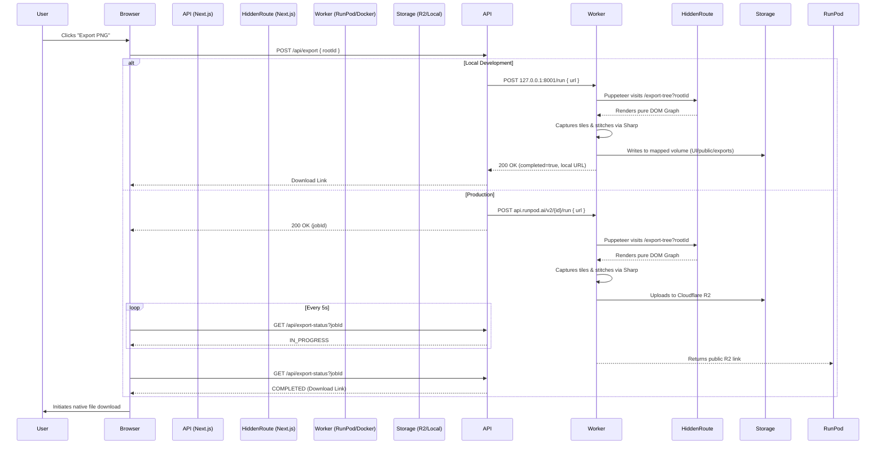

# High-Fidelity Family Tree Exporter Architecture

This document outlines the architecture and data flow for the headless, gigapixel Family Tree PNG exporter. This pipeline replaces browser-side `html-to-image` rendering to prevent memory crashes and browser texture scaling limitations (which previously caused blurred fonts on large family trees).

## 🏗️ System Components

The architecture consists of three distinct layers:

### 1. The Presentation Layer (Next.js UI)
*   **Trigger (`FamilyTreePage.tsx`)**: The user clicks the "Export PNG" button, which fires an asynchronous request to the Next.js API, setting the UI into a loading state.
*   **Hidden Render Route (`/export-tree?rootId=...`)**: A standalone, UI-less route. It fetches the complete family tree graph at maximum depth and mounts the `<ReactFlowTreeCanvas>` purely for screenshots. Backgrounds, menus, and controls are suppressed.

### 2. The Orchestration Layer (Next.js API)
*   **Trigger API (`/api/export`)**: Acts as the router. 
    *   **In Production**: Securely triggers the RunPod Serverless Endpoint using `RUNPOD_ENDPOINT_ID` and `RUNPOD_API_KEY`, returning a RunPod `jobId`.
    *   **In Local Dev**: Routes traffic to `http://127.0.0.1:8001/run` and blocks synchronously since local testing executes instantly.
*   **Polling API (`/api/export-status`)**: *(Production Only)* Polled every 5 seconds by the client to check the RunPod `jobId` status. Once it hits `COMPLETED`, it returns the public S3/R2 download link to the browser.

### 3. The Compute Layer (RunPod Docker Worker)
*   **Environment**: A standalone `ghcr.io/puppeteer/puppeteer:latest` Docker container running an Express.js server on port 8000.
*   **Puppeteer Engine**: Uses headless Chromium to visit the "Hidden Render Route". It waits for a global `window.IS_TREE_READY` signal and reads the `window.TREE_BOUNDS`.
*   **Tile Capture**: Due to hardware limitations on SVG sizes, the Chromium engine drops vector quality if the canvas exceeds ~4000px. Puppeteer captures the graph in perfect 2000x2000 pixel tiles at exactly 1:1 scale to preserve absolute font crispness.
*   **Sharp Stitching**: Uses `sharp` image processing to mathematically stitch the grid of tile buffers together into a gigapixel canvas.
*   **Storage Routing**: 
    *   **In Production**: Uploads the raw buffer via `S3Client` directly to **Cloudflare R2** and returns the public CDN URL.
    *   **In Local Dev**: Triggered by `SAVE_LOCAL=true`, it saves the file directly to `/app/output`, which is volume-mapped to the Next.js `UI/public/exports` directory, allowing the Next.js server to serve the file directly.

---

## 🔄 Execution Flow Diagram

## ⚙️ Environment Variables Summary

| Variable | Location | Purpose |
| :--- | :--- | :--- |
| `RUNPOD_ENDPOINT_ID` | `UI/.env` | Points API to RunPod. Set to `"local"` for local dev testing. |
| `RUNPOD_API_KEY` | `UI/.env` | Authentication token for RunPod API. |
| `SAVE_LOCAL` | `Exporter/.env` | Set to `"true"` to bypass R2 upload and save to the local volume map. |
| `CLOUDFLARE_ACCOUNT_ID` | `Exporter/.env` | S3 endpoint routing for R2. |
| `R2_ACCESS_KEY_ID` | `Exporter/.env` | Secret Key ID for R2. |
| `R2_SECRET_ACCESS_KEY` | `Exporter/.env` | Secret Access Key for R2. |
| `R2_BUCKET_NAME` | `Exporter/.env` | Destination bucket name. |
| `R2_PUBLIC_DOMAIN` | `Exporter/.env` | The public facing CDN domain (e.g., `https://pub-xxx.r2.dev`). |
