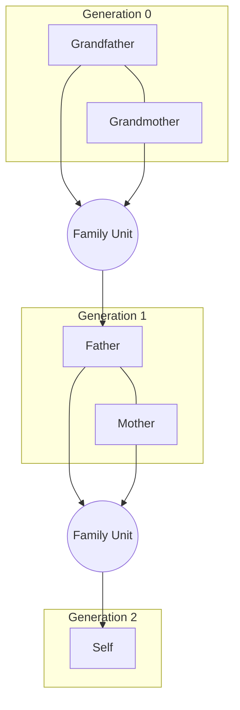

# Genealogy Feature Gap Analysis: Heard Again vs. Industry Standards

This document evaluates the genealogy, family tree visualization, and data modeling features of **Heard Again** compared to industry-standard platforms (such as Ancestry.com, FamilySearch, MyHeritage, and Gramps). 

While Heard Again's unique value proposition is its **AI-driven preservation engine** (voice cloning via Qwen3-TTS, narrative story parsing, and RAG-grounded persona chat), advanced genealogy users expect specific data integrity, citation modeling, and visual navigation capabilities. This analysis identifies where the platform excels, where it falls short, and details a prioritized roadmap to bridge these gaps.

---

## 1. Feature Assessment Matrix

| Functional Area | Heard Again Implementation | Industry Standard Capability | Rating | Primary Gaps |
| :--- | :--- | :--- | :--- | :--- |
| **Data Schema & Modeling** | Relational Postgres via Prisma. Supports multiple names, events, notes, relationships, and external refs. | GEDCOM v5.5.1 and v7 compliant. Highly normalized sources, repositories, and assertion-level citations. | **B+** | Flat source citations; no centralized source/repository tables; database-level relationship types not exposed in UI. |
| **GEDCOM Import/Export** | Asynchronous parser/importer powered by `trigger.dev` and direct Prisma batch insertions. | Robust import/export with ZIP/multimedia matching, duplicate detection, and proprietary tag handling. | **B-** | Missing local media upload matching; no conflict/duplicate merge resolution UI during import. |
| **Tree Visualization** | Dynamic React Flow (`@xyflow/react`) layout engine with BFS generation leveling and spouse grouping. | Multiple interactive layouts (Pedigree, Fan Chart, Descendancy, Family Group) with overlap prevention. | **B** | Visual clutter/crossings under consanguinity (pedigree collapse); no horizontal ancestor/fan views; rigid spacing for multiple partners. |
| **Evidence & Citation** | General citations (`PersonSourceCitation`) and notes (`PersonNote`) attached to individuals. | Every single assertion (dates, places, relationships) must link to primary/secondary source citations. | **C-** | No assertion-level citations; flat data structure; no verification states (e.g., primary vs. speculative). |
| **AI Integration** | **Unique Advantage:** Generates interactive voice profiles and LLM personas directly from tree metadata & stories. | Non-existent or limited to basic photo colorization and auto-generated bio text. | **A+** | None. This is the platform's signature differentiator. |

---

## 2. Deep-Dive Gap Analysis

### 2.1 Genealogical Data Model vs. GEDCOM Standards
The database schema (`prisma/schema.prisma`) is surprisingly robust, supporting a rich set of names, events, and relationships. However, a comparison with the GEDCOM standard reveals several critical limitations:

1. **Flat Source Citations (Denormalization)**:
   * *Heard Again*: The `PersonSourceCitation` model is flat, containing fields like `title`, `author`, `date`, `page`, and `text` directly on the citation record.
   * *Industry Standard*: Sources (`SOUR`) and Repositories (`REPO`) are first-class, normalized entities. A single *Source* (e.g., "1930 US Federal Census") is defined once, and multiple *Citations* reference it, specifying distinct pages, lines, and URLs. Heard Again's flat model leads to massive data redundancy and prevents centralized bibliography management.
2. **Missing Assertion-Level Citations**:
   * *Heard Again*: Source citations are linked directly to the `Person` record.
   * *Industry Standard*: Genealogists require proof for specific assertions (e.g., "Prove that John was born in Boston" vs "Prove that John died in 1890"). Citations must be attachable to individual `PersonEvent` records (Birth, Marriage, Death) or specific name spellings.
3. **UI Exclusion of Schema Capabilities**:
   * The database defines advanced enums like `ParentRelationshipType` (supporting `FOSTER` and `GUARDIAN`) and `PersonEventType` (supporting `BAPTISM`, `BURIAL`, `CREMATION`, `NATURALIZATION`, `IMMIGRATION`, etc.).
   * *UI Gap*: The editing interfaces (`AddEditPersonModal` and `PersonModal`) only expose `BIOLOGICAL`, `ADOPTED`, and `STEP` relationships, and completely hide all lifecycle events other than Birth and Death. Furthermore, `sex` and `maidenName` are not editable via the creation dialog.

### 2.2 GEDCOM Import & Ingestion Pipeline
The import system utilizes a robust parser (`GedcomParser.ts`) and offloads ingestion to `trigger.dev` to handle heavy files asynchronously. However, advanced users will encounter friction:

1. **Broken Media References**:
   * GEDCOM files record media assets via absolute paths (e.g., `FILE C:\Users\Genealogy\Pictures\john_smith.jpg`). When a user uploads a `.ged` file, Heard Again parses the metadata but cannot retrieve the binary files. Standard platforms allow importing a **ZIP archive** containing the `.ged` file along with its referenced media folder, automatically matching and uploading assets.
2. **Lack of Ingest-Time Merge & Conflict Resolution**:
   * Currently, importing a GEDCOM file performing a bulk upsert. If a person already exists in the workspace, the system lacks a matching UI to ask the user: *"We found an existing 'John Smith' (1845-1910). Is this the same person in the imported file? [Merge] or [Keep Separate]?"*
   * While the platform has a database-level `FamilyMergeProposal` system for merging separate *familyspaces*, this matching flow is not exposed during GEDCOM imports, leading to duplicate nodes.

### 2.3 React Flow Visualization Engine
The tree visualization implements a BFS layout algorithm to build generational rows:

While clean for simple structures, it exhibits failure modes on complex trees:

1. **Pedigree Collapse (Consanguinity)**:
   * When distant cousins marry, or siblings from one family marry siblings from another (common in historical trees), a person occupies multiple paths in the tree. The BFS row assignment forces them into a single row, creating crossing lines and visual overlap.
2. **Multiple Partnerships (Serial Marriages)**:
   * If an ancestor had 3 or 4 spouses (e.g., due to remarriage after death), the layout engine struggles to keep all spouses adjacent to their shared children without pushing other branches excessively wide.
3. **No Alternative Navigation Modes**:
   * Users are locked into the dual-direction (vertical ancestor/descendant) layout. Industry standards provide button controls to switch to:
     * **Pedigree View**: A compact horizontal layout tracing direct ancestors (Parents -> Grandparents -> Great-Grandparents).
     * **Family Group Sheet**: A text-heavy card-based view focusing on a couple and their immediate children, ideal for dense data entry.

---

## 3. Prioritized Feature Roadmap

### Phase 1: High Priority (Quick Wins & Data Integrity)
Focuses on exposing database capabilities to the UI and correcting field omissions:

1. **Expose Missing Fields in Creation UI**:
   * Add `sex` (male, female, unknown) and `maidenName` fields to `AddEditPersonModal`.
   * Ensure `sex` maps correctly to `GedcomSex` in the database.
2. **Expose Database-Level Relationship & Event Types**:
   * Update the relationship drop-downs in the UI to support `FOSTER` and `GUARDIAN`.
   * Allow users to add custom lifecycle events (Baptism, Burial, Census, Military Service) on the `PersonModal` edit page.
3. **Enhance Profile Timeline Rendering**:
   * Update `/api/timeline` and the profile timeline component to render all parsed `PersonEvent` types (e.g. Immigrations, Military Service, Burials) with appropriate icons and dates.

### Phase 2: Medium Priority (Advanced User Features)
Enhances the import flow and interactive visualization:

1. **ZIP-Based GEDCOM Media Importer**:
   * Modify the import upload field to accept `.zip` files.
   * Extract the ZIP file in the background task, read the `.ged` file, and upload the accompanying images to the server's asset store, linking them to the parsed `Person` nodes.
2. **GEDCOM Match-and-Merge UI**:
   * Leverage the `FamilyMergeProposal` service during GEDCOM ingestion.
   * Provide a screen showing high-confidence duplicates, allowing users to approve/reject matches before merging records.
3. **Introduce a Horizontal Pedigree View**:
   * Create an alternative layout template in `xyflow/layout.ts` that arranges nodes horizontally (left-to-right).
   * Include a toolbar toggle on the family tree page to switch between Vertical and Pedigree layouts.

### Phase 3: Low Priority (Industry Parity & Compliance)
Refactors core architecture for strict genealogical compliance:

1. **Normalize Sources & Repositories**:
   * Create explicit `Source` and `Repository` Prisma models.
   * Migrate the `PersonSourceCitation` to reference the central `Source` table.
   * Update the `GedcomParser` to build a clean bibliography rather than flattening source attributes.
2. **Implement Assertion-Level Citations**:
   * Modify the database schema to allow a `PersonSourceCitation` to link directly to a `PersonEvent` or `PersonName` record.
   * Add interactive citation pins (little book/evidence icons) next to name fields and dates in the profile view.

---

## 4. AI-Preservation Advantage (The Killer Feature)
It is critical to note that while Heard Again has gap areas in standard data entry, its **AI integration** represents a major leap forward that legacy platforms lack:

* **Voice Signature**: The platform clones the voices of ancestors from historical cassettes or video uploads, allowing family tree nodes to "speak" their recorded histories.
* **Grounded Chat Engine**: Instead of just reading a flat PDF or biography, descendants can ask questions to an AI persona of their ancestor, which uses the timeline events, notes, and citations as a strict vector database (RAG) to ensure accuracy.

By executing the prioritized roadmap above, Heard Again will combine industry-standard genealogical integrity with state-of-the-art AI preservation, creating an unmatched offering for both casual and advanced users.
